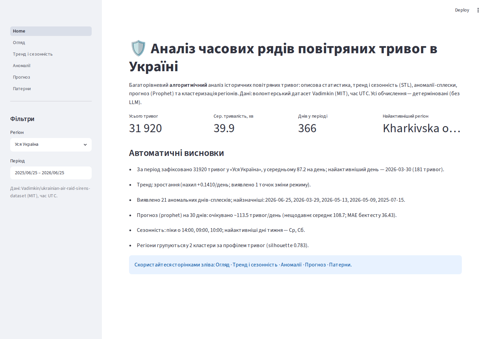
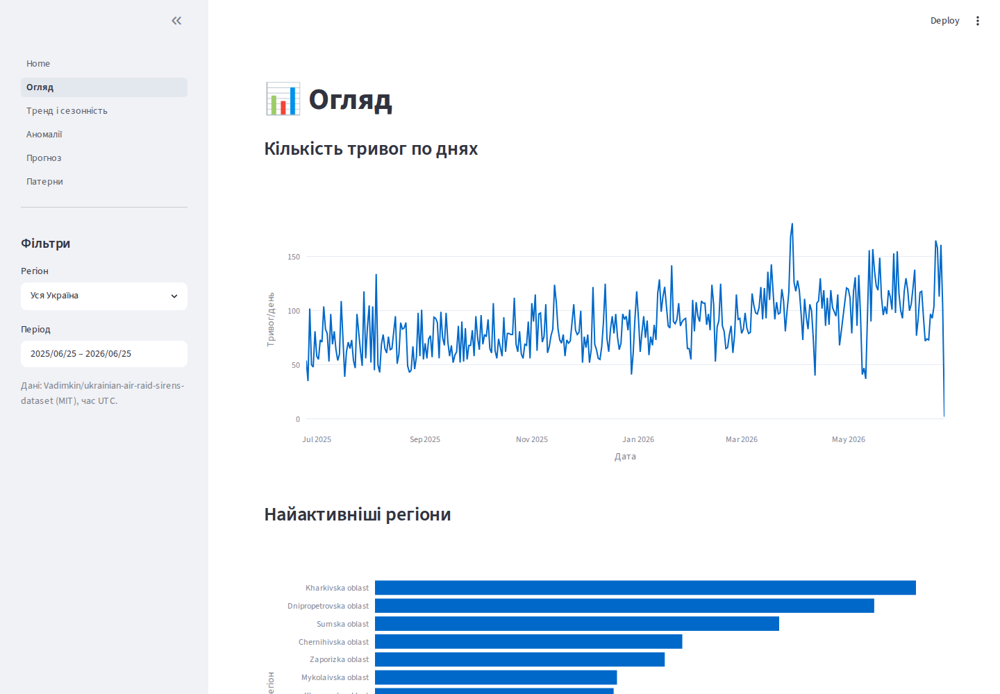
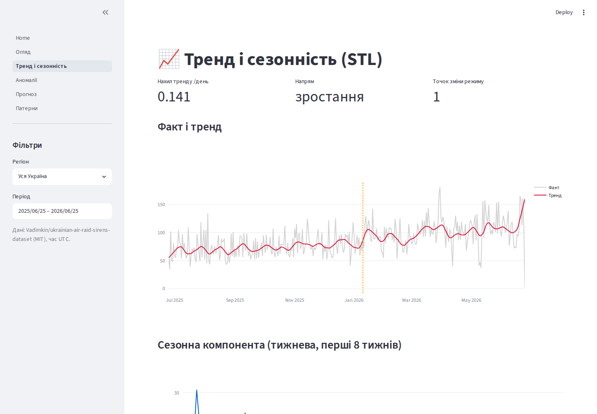
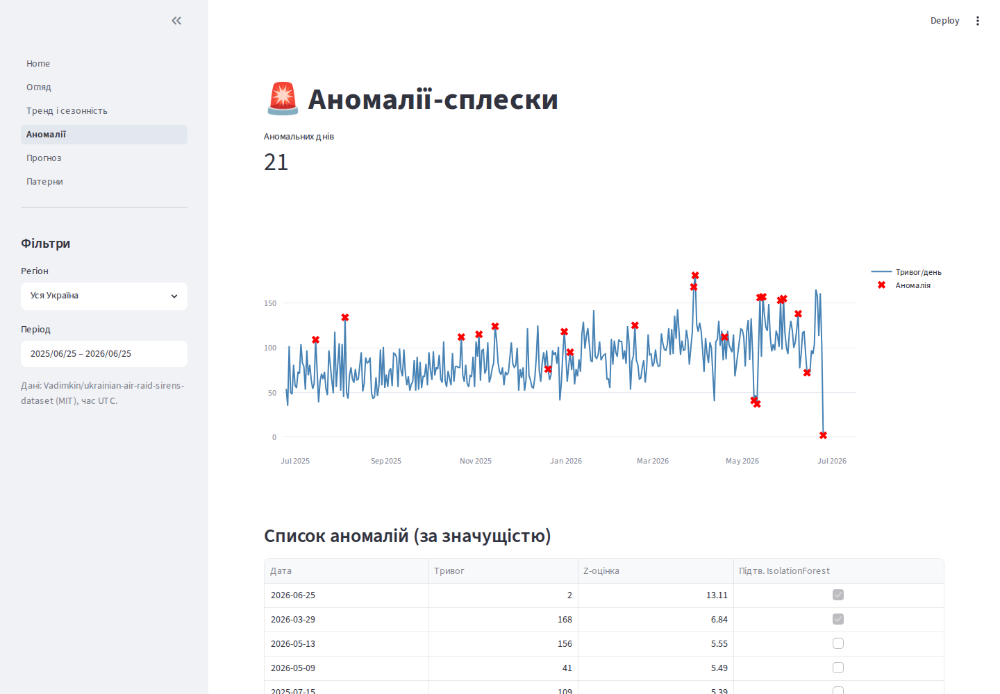
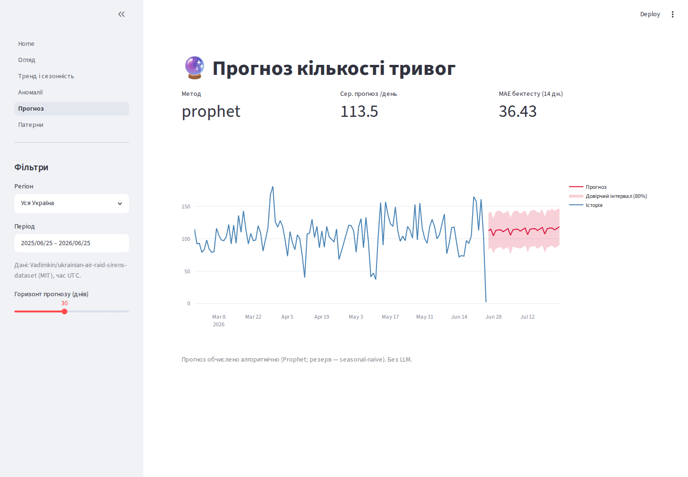
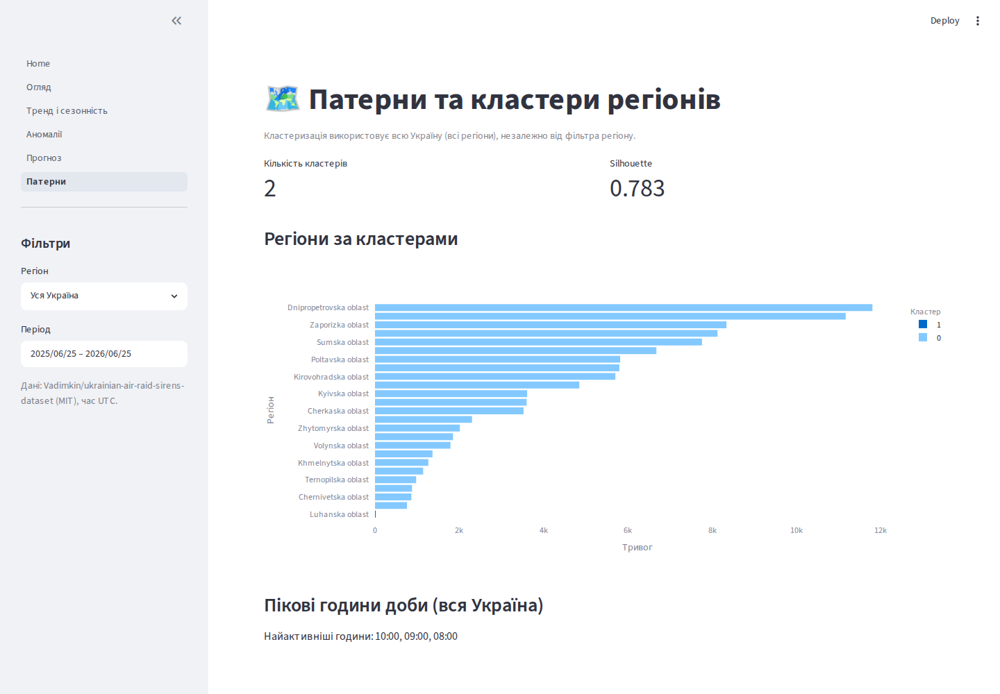

# 🛡️ Аналіз часових рядів повітряних тривог в Україні

Веб-застосунок для **багаторівневого алгоритмічного аналізу** історичних попереджень про повітряну тривогу в Україні: описова статистика, тренд і сезонність, аномалії-сплески, прогноз і кластеризація регіонів — з автоматичними текстовими висновками. Усі обчислення **детерміновані** (без LLM).

> **Проблема, яку вирішує застосунок:** дати волонтерам, аналітикам і громадянам наочний інструмент, щоб зрозуміти динаміку тривог — коли їх більшає, які регіони найнебезпечніші, коли трапляються сплески, чого очікувати найближчим часом і за яким добовим/тижневим патерном вони відбуваються.

## ✨ Можливості (багаторівнева система аналізу)

| Рівень | Сторінка | Що показує | Метод |
|---|---|---|---|
| 0 | (фон) | Завантаження + нормалізація подій у часові ряди | pandas |
| 1 | **Огляд** | KPI, найактивніші регіони, heatmap «день тижня × година» | pandas |
| 2 | **Тренд і сезонність** | Тренд, тижнева сезонність, точки зміни режиму | statsmodels **STL**, ruptures |
| 3 | **Аномалії** | Дні-сплески з оцінкою значущості | робастний z-score (MAD) + **IsolationForest** |
| 4 | **Прогноз** | Прогноз кількості тривог із довірчим інтервалом | **Prophet** (+ seasonal-naive резерв), backtest MAE |
| 5 | **Патерни** | Кластеризація регіонів за профілем тривог, пікові години | **KMeans** + silhouette |
| — | **Home** | Зведені KPI + автоматичні висновки з усіх рівнів | детерміновані шаблони |

## 🖼️ Скріншоти

**Головна — KPI та автоматичні висновки**


**Огляд — динаміка по днях, топ регіонів, heatmap**


**Тренд і сезонність (STL)**


**Аномалії-сплески**


**Прогноз (Prophet, 80% довірчий інтервал)**


**Патерни та кластери регіонів (KMeans)**


## 🧰 Технологічний стек (усе НЕ-AGPL)

| Шар | Бібліотека | Ліцензія |
|-----|-----------|----------|
| UI | Streamlit | Apache-2.0 |
| Графіки | Plotly | MIT |
| Дані | pandas, numpy | BSD |
| Декомпозиція | statsmodels (STL) | BSD |
| Прогноз | Prophet | MIT |
| Аномалії / кластери | scikit-learn | BSD |
| Точки зміни | ruptures | BSD |
| Тести | pytest | MIT |
| Верифікація UI | Playwright | Apache-2.0 |

## 📦 Дані

Волонтерський датасет [Vadimkin/ukrainian-air-raid-sirens-dataset](https://github.com/Vadimkin/ukrainian-air-raid-sirens-dataset) (**MIT**): файл `volunteer_data_en.csv`, рівень областей, час у **UTC**, з 24–25.02.2022. Колонки: `region, started_at, finished_at, naive` (якщо кінець відсутній — `started_at + 30 хв`). Завантажується автоматично й кешується у `data_cache/`.

## 🏗️ Архітектура

```
data (loader, preprocess) → analysis (descriptive, decomposition, anomaly, forecast, patterns)
                          → insights (детерміновані висновки) → Streamlit UI (app/)
```

> **Примітка про мультиагентність.** Початково проєкт містив шар «Оркестратор → Агенти → Суддя» через `claude` CLI для текстових інтерпретацій і валідації. За рішенням замовника його **прибрано** на користь повністю алгоритмічного підходу — прогноз і весь аналіз ніколи не залежали від LLM (Prophet/STL/KMeans), а текстові висновки тепер формуються детерміновано (`analysis/insights.py`). Історія дослідження збережена у `Plan_Folder/Docs/`.

## 🚀 Запуск (інструкція)

**Вимоги:** Python 3.11+ (рекомендовано 3.12), інтернет при першому запуску (для автозавантаження датасету).

```bash
# 1. Клонувати репозиторій
git clone https://github.com/AZAR1VAN/kse-project-v1.git
cd kse-project-v1

# 2. Віртуальне середовище + залежності
#    варіант А (uv, швидко):
uv venv --python 3.12 .venv && source .venv/bin/activate
uv pip install -r requirements.txt
#    варіант Б (стандартний pip):
#    python3 -m venv .venv && source .venv/bin/activate && pip install -r requirements.txt

# 3. Запуск дашборду
streamlit run app/Home.py
```

Відкрийте у браузері **http://localhost:8501**. На першому запуску застосунок автоматично завантажить
датасет Vadimkin у `data_cache/` (далі читає з кешу, без мережі). Користуйтеся фільтрами **Регіон** і
**Період** у бічній панелі та сторінками зліва: Огляд · Тренд і сезонність · Аномалії · Прогноз · Патерни.

> Windows (PowerShell): активація середовища — `.\.venv\Scripts\Activate.ps1`.

## ✅ Тести та верифікація

```bash
# Юніт-тести (data + analysis)
pytest -q

# UI-верифікація: скріншоти всіх сторінок (Streamlit має бути запущений на :8501)
npm install playwright && npx playwright install chromium
node scripts/playwright_screenshots.js     # збереже /tmp/airalerts-*.png
```

Скріншоти у `docs/screenshots/` отримані цим скриптом; усі сторінки рендеряться без винятків і трейсбеків.

## 🗂️ Структура проєкту

```
src/airalerts/        # data/ , analysis/  — детерміноване ядро
app/                  # Streamlit: Home.py + pages/
tests/                # pytest
docs/screenshots/     # скріншоти інтерфейсу
scripts/              # playwright_screenshots.js
Plan_Folder/          # Global_Roadmap.md, Task{N}.md/Plan{N}.md, Docs/ (дослідження)
log.md                # журнал роботи
requirements.txt
```

## 📋 Планування (Plan_Folder)

`Plan_Folder/` містить процес планування: `Global_Roadmap.md` (мілстоуни R1–R7), пари `Task{N}.md`/`Plan{N}.md` на кожен пункт, теку `Docs/` з дослідженнями агентів (дані, методи аналізу, оркестратор, суддя), на основі яких сформовано RoadMap. `log.md` — повний журнал запитів і дій.

## 📄 Ліцензії

Усі залежності — дозвільні (Apache-2.0 / MIT / BSD), **без AGPL**. Дані — MIT (Vadimkin dataset).
